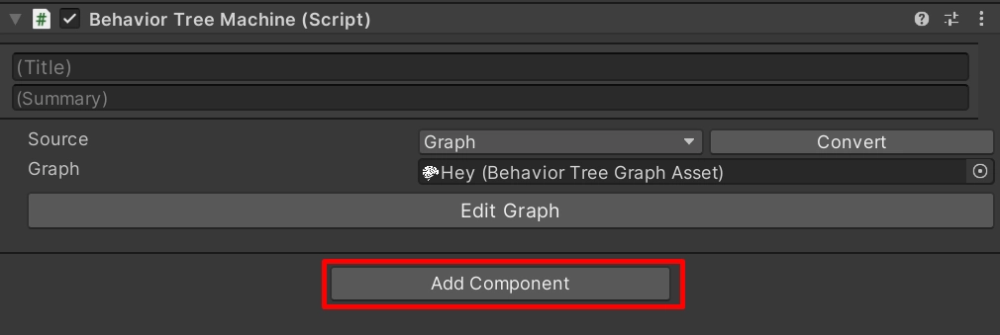

# Your first tree

A working behavior tree in five steps, and the two mistakes that catch everyone on day one.

Before you start: BH3 must be [installed](01-installation.md) and Visual Scripting initialised.

---

## 1. Create a tree asset

Right-click in the Project window → **Create → Visual Scripting → Behavior Tree**.

This creates a `.asset` file holding the tree definition. Name it after the agent it will drive.

## 2. Open the graph editor

Double-click the asset. The **Behavior Tree** window opens with an **Entry** node already on the canvas.
Entry is the root: it cannot be deleted and takes exactly one child.

You can also open the editor with the **Edit Graph** button on the asset's inspector, or on a
**Behavior Tree Machine** component. [The graph editor](../2-building-trees/01-the-graph-editor.md) is the
full tour.

## 3. Build the tree

Right-click the canvas to add a node from the menu. To connect a parent to a child, **hold `Ctrl`, drag from
the parent onto the child, and release**. Press `Esc` to cancel a drag.

Build this:


```
Entry → Repeater → Sequence → ( Wait , Add Force )
```

- **Sequence** runs its children in order and stops at the first one that fails.
- **Wait** (under **Flow**) pauses for `Time` seconds. Its `Time` port has no default, so feed it: add a
  **Literal → Float**, set it to `1`, and drag from its output pin to the `Time` pin.
- **Add Force** (under **Physics**) pushes a Rigidbody. Leave `Target` empty and it acts on the agent itself.
- **Repeater** sends the Sequence around again forever.

## 4. Add the machine

Add a **Behavior Tree Machine** component to a GameObject with a Rigidbody, and drag the tree asset into its
**Graph** field.



The machine needs a **Variables** component. Unity adds one automatically.

## 5. Press Play

The machine loads the tree on `Awake`, enters it on `Start`, and ticks it every frame in `Update`. The
object gets a push every second. Keep the graph window open and the running branch lights up as it executes.

---

## The two things that catch everyone

### Put a Repeater under Entry

The machine stops ticking once the root returns `Success` or `Failure`. A tree without a **Repeater** near
the top runs **exactly once** and then goes silent, which looks identical to "my tree is broken".

If your tree does something once and then never again, this is almost always why.

### The badge is the priority, not the position

Every child of a Sequence or Selector shows a small numbered badge in its corner. **That number is the order
the runtime uses**: a Selector tries badge 1 first, then 2, and so on.

Dragging a child sideways past a sibling renumbers the badges, so the natural way of working, laying branches
out left to right in the order you want them tried, keeps working. But read the badge, not the picture: if a
badge turns **amber**, the layout and the priority disagree. [Execution order](../2-building-trees/05-execution-order.md)
explains the rule.

---

## Next

- [Core concepts](03-core-concepts.md) — the mental model on one page
- [The graph editor](../2-building-trees/01-the-graph-editor.md) — the window in detail
- [Node reference](../2-building-trees/02-node-reference.md) — what ships in the box
