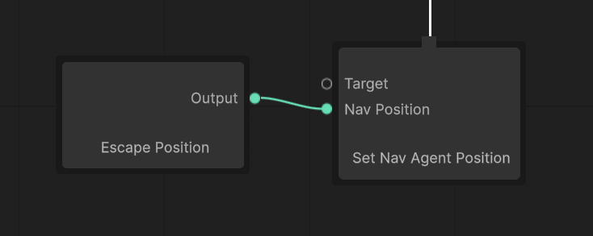

# Core concepts

The whole mental model on one page. Every later guide assumes these eight ideas; each links to the page
that goes deeper.

---

## 1. A tree runs one tick at a time

Every frame, the **Behavior Tree Machine** ticks the tree. A tick starts at **Entry** and walks down. Each
node that runs returns a **status** to its parent:

| Status | Means |
|---|---|
| `Success` | Done, and it worked |
| `Failure` | Done, and it did not |
| `Running` | Not done yet; ask me again next tick |

A node that needs several frames, such as **Wait** or **Move To**, returns `Running` until it finishes.

Two things follow. **The machine stops ticking once the root returns `Success` or `Failure`**, which is why
every real tree has a **Repeater** directly under Entry. And a tick is one update of one agent's tree, so
tick numbers in the debugger are per agent.

## 2. Composites decide, leaves act

A tree has three kinds of node:

| Kind | Children | Job |
|---|---|---|
| **Composite** | many | Decide which children run. **Sequence** runs them in order and stops at the first `Failure`. **Selector** runs them in order and stops at the first `Success`. |
| **Decorator** | one | Change how the child runs or how its result reads: **Repeater**, **Cooldown**, **Until Success**, **Return Failure**. |
| **Leaf** | none | Do something (an **action**) or answer a question (a **condition**). |

A Selector's children are its **priorities**: the first child is what the agent would rather do, the last
is the fallback. That order is stored on the connections and shown as a numbered badge on each child. See
[Execution order](../2-building-trees/05-execution-order.md).

## 3. Ports separate what a node does from where its data comes from

This is the idea BH3 is built around. A node declares **ports**, typed inputs and outputs. **Set Nav Agent
Position** has a `NavPosition` input; it reads it and moves. It has no idea whether the value came from:

- a **literal** typed on the canvas,
- a **Get Variable** node reading the blackboard,
- another node's output, such as **Generate Random NavMesh Position**,
- or a whole Visual Scripting graph, through a **Script Graph Variable** node.

Swap the left side for anything else and the right side neither knows nor cares. That is what lets
designers rewire behaviour without touching code, and what lets one node serve every agent.

A port with a **default** can be left unwired. A port without one **must** be wired, or reading it throws
and the node shows a problem badge. See [Ports and wiring](../2-building-trees/03-ports-and-wiring.md).

## 4. Variables have a kind, and a scope

A variable lives in one of five stores, chosen on the node that reads or writes it:

| Kind | Where it lives | Use it for |
|---|---|---|
| **Graph** | The running tree instance | A branch's own working values |
| **Object** | The agent's `Variables` component | Facts about the agent: `hasTarget`, `lastKnownPosition` |
| **Scene** / **Application** / **Saved** | The wider Unity stores | Things bigger than one agent |

**Graph** variables are scoped. A branch reads its own first, then its caller's, out to the root, so it sees
anything the agent passed down. But it **writes only its own**: nothing a branch does leaks sideways into a
sibling, and two copies of the same branch never collide. **Object** variables are the opposite on purpose:
shared by every branch on the agent, and the only kind a guard can watch. See
[Variables and scope](../2-building-trees/04-variables-and-scope.md).

## 5. Guards decide when a branch may run, and when it must stop

A **guard** is a precondition drawn beside a node rather than above it. BH3 has two:

| | Conditional Execution | Reactive Guard |
|---|---|---|
| Asks | *May I start?* | *Is this still true?* |
| When | Once, at entry | At entry, then on a schedule while the branch runs |
| If false while running | Nothing; it already stopped caring | **Stops its own branch**, and every node under it exits |
| If true while a lower-priority sibling runs | Nothing | **Takes over** that sibling's slot on the same frame |

Reactive guards are how interruptions work: put `targetInRange` on Attack and `hasTarget` on Chase, and Idle
needs no guard at all. Each branch states only its own precondition. See
[Guards](../2-building-trees/06-guards.md).

## 6. A branch is a function

A **Run Behavior Tree Graph** node runs another tree asset as a **sub-tree**. The sub-tree declares
**parameters**, which appear as input ports on the node that calls it, so the same Patrol asset runs on a
Zombie with `idleTime = 3` and on a Soldier with `idleTime = 1` without either knowing the other exists.

Each call site gets its own instance and its own Graph scope. Values *into* a branch are parameters; facts
*about* the agent are Object variables. Keeping those apart is what makes a branch reusable. See
[Sub-trees](../2-building-trees/07-sub-trees.md).

## 7. Functions are shared graphs with a contract

A **Function** is a Visual Scripting graph saved as its own asset, with declared inputs, a declared result,
and the agent facts it reads. A **Script Graph Variable** node runs one and offers the result on a port; the
Function's inputs become ports on the node. Write `IsHurt` once and every tree that needs it references the
same asset. See [Functions](../2-building-trees/08-functions.md).

## 8. Everything the tree does is recorded

While an agent runs in the editor, a **flight recorder** logs every node entered and exited, every guard that
changed its mind, every variable written and by whom. The debugging panels read that recording rather than
guessing:

- **Timeline**: scrub back to any tick and see the tree as it was.
- **Why panel**: click a node, read why it did what it did.
- **Variable Watch**: what every variable held at that tick, and who wrote it.
- **Breakpoints**: stop the editor the moment it happens again.

Recording is on by default in the editor and costs a little per agent; a **Rec** switch on the Timeline turns
it off. See [Debugging](../3-debugging/01-overview.md).

---

## Next

Work through [Building trees](../README.md#2-building-trees) in order, starting with
[The graph editor](../2-building-trees/01-the-graph-editor.md).
