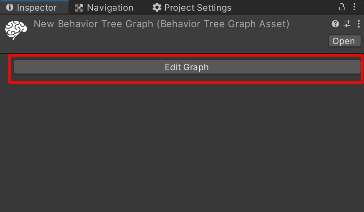
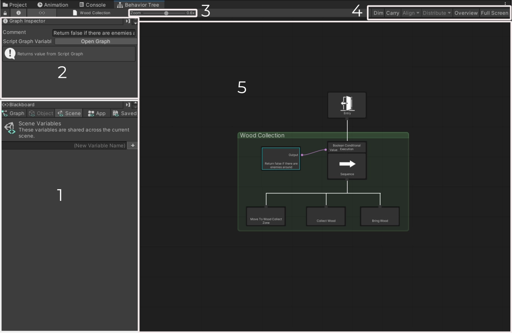
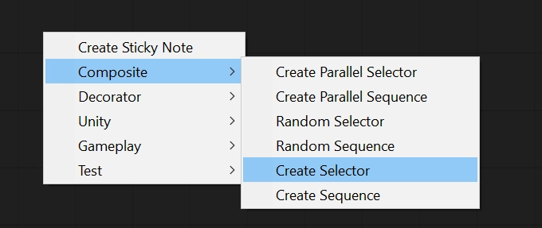
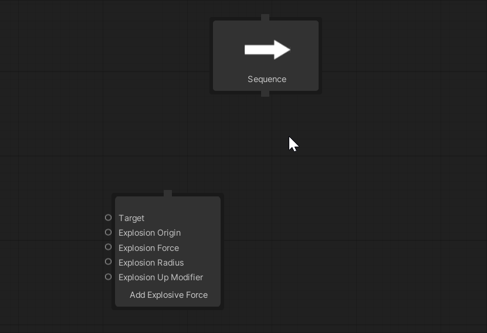
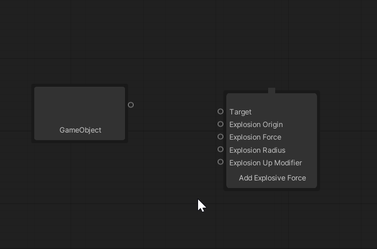
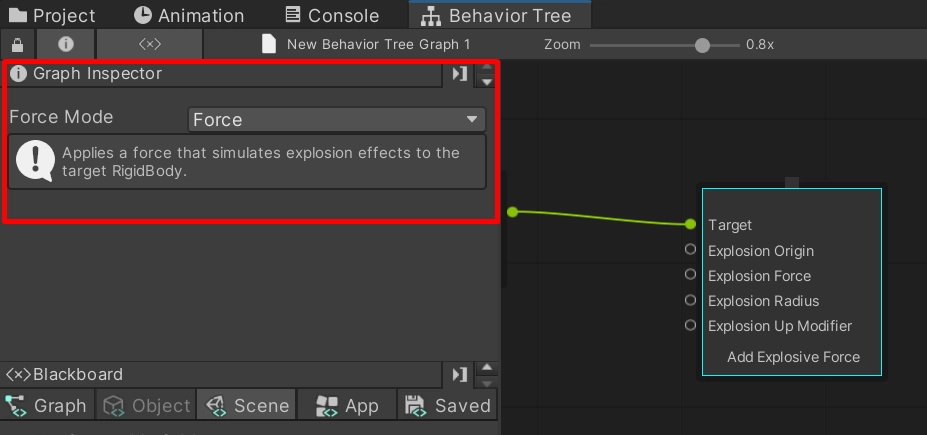

# The graph editor

The **Behavior Tree** window, where you create, connect and inspect nodes, and the panels that live in it.

---

## Opening it

Double-click a Behavior Tree asset, or use the **Edit Graph** button on the asset's inspector or on a
**Behavior Tree Machine** component. Opening through the machine is worth doing while debugging: the
window then knows which agent it is showing.

The machine's **Source** dropdown chooses where its tree comes from. **Graph** references a tree asset,
which is what you want almost always: the same asset drives many agents, and every guide here assumes it.
**Embed** stores a private tree on the component itself, for a one-off that no other object will run.

---

## Layout

| Area | What it is |
|---|---|
| **1 — Blackboard** | Variables in every store, as tabs: **Graph**, **Object**, **Scene**, **App**, **Saved**. The Graph tab has three lists, **Instance**, **Required** and **Optional**; the last two are the tree's parameters. See [Variables and scope](04-variables-and-scope.md) |
| **2 — Graph Inspector** | The selected node: its settings, its description, and any problems it reports with a button to fix them |
| **3 — Zoom** | Canvas zoom |
| **4 — Toolbar** | **Dim** (fade nodes that are not running), **Carry** (drag a node's children with it), **Align** and **Distribute** (with two or more nodes selected), **Overview** (fit the whole tree), **Full Screen** |
| **5 — Canvas** | The tree |

The two toggle buttons at the left of the toolbar show and hide the Blackboard and the Graph Inspector.

### The debugging panels

Four more panels share the window. They are described in [Debugging](../3-debugging/01-overview.md):

| Panel | Where | Answers |
|---|---|---|
| **Why** | Left sidebar, below Blackboard | Why a node did what it did |
| **Breakpoints** | Left sidebar | Where the editor should pause |
| **Variable Watch** | Right sidebar (drag its anchor button to move it) | What a variable held at a tick, and who wrote it |
| **Timeline** | A strip under the canvas | What the tree looked like at any tick |

A sidebar stacks its panels, each under a header bar with the panel's name. Click a header to collapse or
expand that panel, and drag the border between the sidebar and the canvas to resize it. The Timeline
collapses with the small triangle in its own header.

BH3's other editor tools sit under two menus: **Tools → BH3** (the raw Flight Recorder window) and
**Window → Arcane Onyx → BH3** (the broken-graph finder).

---

## Creating nodes

Right-click anywhere on the canvas and pick a node from the menu.

Categories are named for what the node does: **Composite**, **Decorator**, **Condition**, **Flow**,
**Variables**, **Literal**, **Math**, **Logic**, **Navigation**, **Transform**, **Physics**, **Animation**,
**Game Object**, **Audio**, **Debug** and **Visual Scripting**. Every node is listed in the
[Node reference](02-node-reference.md). Your own C# nodes appear under whatever category you give them;
see [Custom nodes](../4-extending-with-csharp/01-custom-nodes.md).

| Action | How |
|---|---|
| Delete | Select, then `Delete` |
| Duplicate | `Ctrl + D` |
| Copy / Cut / Paste | `Ctrl + C` / `Ctrl + X` / `Ctrl + V` |
| Fit the tree in view | `Home`, or the **Overview** button |
| Cancel a connection drag | `Esc` |

Every node can be copied and duplicated, including the Visual Scripting ones: they reference a
[Function](08-functions.md) asset rather than owning a graph, so two copies sharing one is what sharing
means.

---

## Connecting nodes

**Parent to child:** hold `Ctrl`, drag from the parent onto the child, and release.

**Port to port:** drag from an output pin to an input pin. The canvas only lets you connect types that
convert: an `int` output can feed a `float` port, a `GameObject` can feed a `Transform` port. See
[Ports and wiring](03-ports-and-wiring.md).

A **Decorator** and **Entry** accept one child; the canvas refuses a second wire. Nodes that only offer
outputs, such as literals and **Get Variable**, are never given a parent: they are read through their ports
and sit unparented on the canvas.

### The priority badge

Every child of a Sequence or Selector shows a small number in its corner, counting from **1**. That is the
order the composite tries its children. Drag a child past a sibling and the badges renumber; a child you
connect takes the number of the place it sits in, and deleting one closes the gap. An **amber**
badge means the canvas layout and the stored order disagree; the tree still runs in badge order. See
[Execution order](05-execution-order.md).

### Guards

A **Conditional Execution** or **Reactive Guard** is not parented either. Right-click the node it should
protect and pick the guard from that menu: it is created attached to that node as its **owner**. Guards are
not in the canvas menu, because a guard without an owner means nothing. See [Guards](06-guards.md).

---

## The node inspector

Select a node to open it in the **Graph Inspector**. Most nodes are driven through ports, but a node can
also expose plain settings here, such as **Set Variable**'s variable kind or **Add Force**'s force mode, when
a port would be overkill.

The inspector also shows the node's own description, the quickest way to check what a node does without
leaving the window.

### Problem badges

A node that cannot work as authored says so before you press Play: a **red** border and icon for an error
(it will throw or silently do the wrong thing), **amber** for a warning (it will still do something sensible).
Hover the icon for the reason. Select the node and the inspector lists the same problems, with a button
beside each one that can be fixed in one click. See [Checking your tree](09-checking-your-tree.md).

---

## Sticky notes

**Create Sticky Note**, at the top of the right-click menu, adds a note to the canvas. Trees get large
quickly, and a note naming what a branch is for pays for itself.

---

## Next

- [Node reference](02-node-reference.md)
- [Ports and wiring](03-ports-and-wiring.md)
