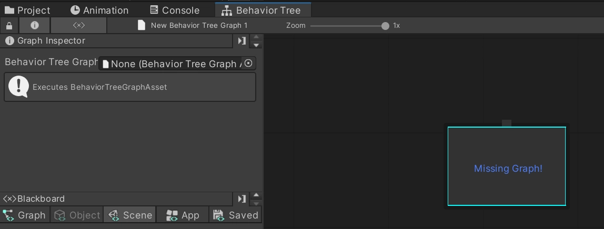
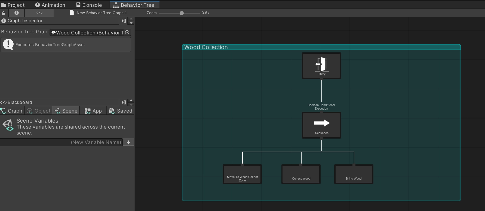
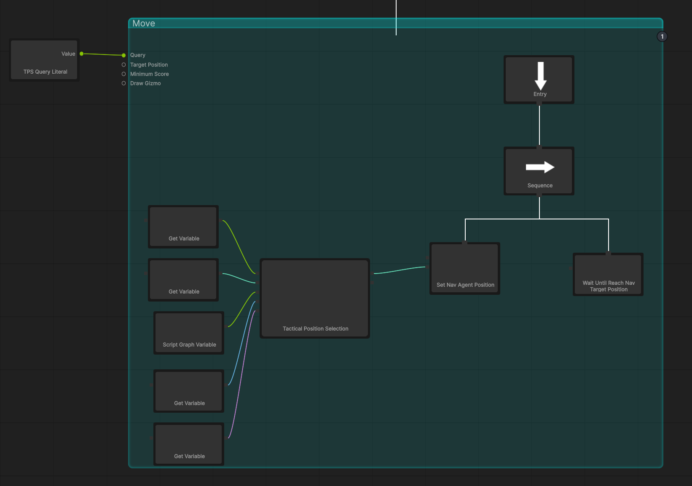

# Sub-trees

Reusing a branch across agents, and passing arguments to it.

---

## What they are for

A sub-tree lets one tree run another. In an FPS, different enemies behave differently but all share the
same shooting logic, so you build "shoot" once as its own asset and reuse it everywhere, instead of copying
nodes between trees and maintaining every copy.

Use **Flow → Run Behavior Tree Graph**. Until you assign an asset the node reports itself as missing:

Assign one in the node inspector and a simplified, read-only preview of that tree is drawn on the canvas:

You cannot edit the preview. Open the sub-tree asset to change it.

Otherwise the node behaves like any other: it has a status and finishes at some point, unless the sub-tree
keeps itself alive with a `Repeater`. Nesting can go to any depth.

---

## Think of a branch as a function

A Zombie tree might have three branches, Idle, Chase and Attack, and each knows nothing about its caller or
its siblings. Idle does not check for enemies and does not decide to transition to Attack; a guard on the
call site decides when Idle stops being valid. The glue lives only in the Zombie tree.

What makes that literally true is **parameters**.

### Where the analogy stops

A function returns; a branch does not. It runs over many ticks, can end in `Success` or `Failure`, and can be
aborted mid-run by a guard, so there is no single moment at which it hands a value back.

**There are no output ports, deliberately.** Data a branch produces that needs to outlive it is *agent
state*: write it as an Object variable and let whatever needs it read from there.

> Values going **into** a branch are parameters. Facts about the agent are agent state. Keeping those two
> separate is the whole discipline.

---

## Parameters

A tree declares variables in three lists, in the Blackboard panel's **Graph** tab:

| List | Meaning | Becomes a port on the caller? |
|---|---|---|
| **Instance** | the tree's own internal variables | no |
| **Required** | a parameter the caller **must** pass | yes, with no default |
| **Optional** | a parameter with a default the branch carries itself | yes, with that default |

Every Required and Optional declaration becomes one input port on the **Run Behavior Tree Graph** node that
runs the tree. Feed those ports like any other: a literal, a variable read, or a Function.

The branch never learns a variable name from its caller, so the same Idle works on a Zombie, a Soldier or a
Draugr.

### Required or Optional?

One question: **is there a value that is right most of the time?**

- `idleTime = 3` usually is. Make it **Optional** and every call site inherits it.
- `attackRange` is not: a Zombie's is 1.5 and an Archer's is 20. Make it **Required** and force the caller
  to say.

A Required port with nothing connected shows a problem badge, and throws on entry naming the parameter, the
node and the sub-tree.

### Arguments are re-read on every entry

Parameters are applied when the branch is **entered**, not once at load. A port fed by a variable read or a
Function is evaluated afresh each time the branch starts, like an argument evaluated at each call.

---

## Scopes: what a branch can see

Every running tree instance gets its own variable scope, and a sub-tree asset is instantiated **per call
site**. Two branches running side by side under a Parallel hold two different scopes and cannot collide.

- **Reads walk outward.** A branch looks in its own scope first, then its caller's, out to the root, so it
  still sees anything the agent supplied.
- **Writes stay local.** A `Set Variable` of kind Graph writes only the branch that ran it.
- **Agent state is Object.** Anything belonging to the whole agent is an Object variable on the agent's
  `Variables` component, shared on purpose.

Because the scope is per call site, using the same branch twice with different arguments keeps them apart.
Passing data by agreeing on a variable name is never necessary. See
[Variables and scope](04-variables-and-scope.md).

### How long an instance lives

The instance is created **lazily, on first use**, and released when the tree holding it is destroyed. A
destroyed agent takes its whole tree of instances with it, at every depth, and a branch the agent never
entered is never instantiated at all.

Nothing else can free these. The count is per call site, per agent, multiplied by nesting, which is worth
knowing before a wave-based scene spawns hundreds of modular agents.

---

## Refreshing the contract

The caller's ports are built from a **copy** of the sub-tree's parameter list, stored on the calling node,
rather than read live from the other asset. That is deliberate: ports are rebuilt during deserialization,
and reading across to another asset that has not loaded yet would silently drop wiring.

The cost is that the copy can go stale. So it is **reported rather than silently applied**: change a
branch's parameters and every caller shows a problem badge naming what changed. Right-click the node, or
use the button in its inspector, and choose **Refresh Parameters**, which rebuilds the ports.

> Refreshing removes ports the branch no longer declares, and drops whatever was feeding them. The report
> says so before you do it.

---

## Two rules that bite

**A tree must not reach itself.** Recursion is checked whenever a tree is loaded and throws with the path
that caused it, like `A -> B -> A`. Reuse is judged per path: the same sub-tree used by two different
branches is normal; the same asset appearing twice on *one* path is a cycle.

**Guards do not cross the boundary.** A guard protects a node inside its own graph. To let a caller interrupt
a sub-tree, put the guard on the **Run Behavior Tree Graph node itself**, in the parent tree. That is the
usual place for one anyway: branch in its own asset, guard at the call site. A reactive guard there aborts
the whole sub-tree, and the abort reaches every node inside the instance.

---

## Next

- [Functions](08-functions.md) — the same idea for a value instead of a branch
- [Best practices](10-best-practices.md#give-each-branch-its-own-tree-asset)
- [Why panel](../3-debugging/03-why-panel.md) — a shared branch running in two places is two different stories; the panel has a call-site picker for exactly that
