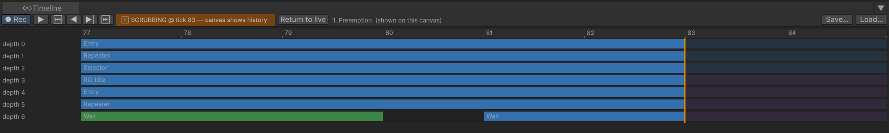

# The Timeline

What the tree looked like at any tick: scrub through the recording, watch branches come and go, and hand a
recording to someone else.

---

## Where it is

The **Timeline** is a full-width strip **under the canvas**, not in the sidebar, because its axis is time.
Drag its top edge to make it taller; the canvas gives up the space. The small triangle in its header
collapses it.

Press Play with a tree open and it starts filling in within a few seconds:



## Reading the lanes

One lane per nesting depth, labelled `depth 0`, `depth 1`, and so on. A bar is one node running, from the
tick it entered to the tick it exited, coloured by how it ended. Aborted and taken over are different
colours on purpose, because they are different claims.

**A gap on a lane means nothing ran there.** When a Selector falls through past a guarded branch, that
branch has no bar at all: it never entered, which is a different thing from having run and failed.

**Pins** mark moments:

| Pin | Means | Hover text |
|---|---|---|
| **Red** | A guard aborted a running branch | `Aborted at tick N by guard 'label'` |
| **Blue** | A sub-tree was entered or left | `Entered sub-tree 'label' at tick N` / `Left sub-tree 'label' at tick N` |

**Double-click** a pin or a bar to select that node or guard on the canvas. A single click on the track
scrubs instead.

## Scrubbing

**Drag the playhead**, or click anywhere on the track. The canvas **ghosts**: every node's status and every
lit connection becomes what it was at that tick, dimmed, and the toolbar shows an amber banner:


That is history, not the present. The agent keeps running behind it. **Return to live** hands the canvas
back, and the banner returns to `● LIVE — tick N`.

While you are parked, every other panel is parked with you: the [Why panel](03-why-panel.md) explains that
tick, and the [Variable Watch](04-variable-watch.md) shows the values at that tick with an orange header
saying so.

A bar is drawn in two halves around the playhead: the part already reached is coloured by what was true at
the playhead, and the part still in the future is dimmed. So a Selector that is mid-run at tick 300 reads as
*running* when you park there, even if it went on to succeed at tick 350.

## Moving through time

The toolbar reads, left to right: the **Rec** switch, the **play** button, then four step buttons.

| Control | Does |
|---|---|
| **Play** (the first button after Rec) | Plays the recording back at roughly real time from its first tick. When it catches up with the newest tick it returns to live on its own |
| **Previous change** / **Next change** (the outer pair, ⏮ ⏭) | Jump to the previous or next tick where the set of running nodes **changed**. In a quiet tree that can be hundreds of ticks; single-stepping would show the same picture over and over |
| **Step back** / **Step forward** (the inner pair) | Move exactly one tick |
| **Return to live** (appears in the banner while scrubbing) | Hand the canvas back to the running agent |
| Scroll wheel | Zoom around the cursor |
| Middle-drag | Pan |

Bars are colour-coded by outcome, one colour each for running, succeeded, failed, aborted and taken over;
hover a bar or a pin for the words.

The `⏱` buttons in the Why panel and the Variable Watch scrub the Timeline to the tick they name. That is
the loop the panels are built around: the explanation says *when*, the Timeline shows *what it looked like*.

## The Rec switch

The leftmost toolbar button, **● Rec**, turns recording off for every agent. The banner changes to
`○ RECORDING OFF — tick N`, the lanes stop growing, and the Why, Variable Watch and Breakpoints panels each
show a warning saying so. Click it again to resume from the current tick.

Off lasts **for the rest of the editor session**, including across Play, until you turn it back on or restart
the editor. That is deliberate: a scene being profiled should not pay for the recorder, and should not
silently start paying again on the next Play. Press it before Play and it is still off after Play.

## Saving and loading a recording

**Save…** writes the whole recording to a JSON file, named `<Agent>-recording.json` by default, wherever you
choose. **Load…** opens one. While a file is open, the source label names it, the Save and Load buttons are
replaced by **Close**, and every panel explains the file instead of a live agent: same lanes, same pins,
same ghosting, with no scene running.

A recording plus the tree asset is a complete account of what an agent did. That is how you hand a bug to
someone else: they read the same explanations you can, on a machine that never ran your scene.

Save and Load live here and nowhere else, so that only one recording can be open at a time and every panel
is describing the same one.

## When the buffer is full

The recorder keeps the most recent events; older ones are dropped. When that has happened, the footer says
so:

```
Buffer clipped: 1204 older events dropped — the left edge is a cut, not a beginning.
```

Raise `BehaviorTreeFlightRecorders.DefaultCapacity` before agents spawn, or reproduce the problem closer to
the moment you start watching.

## If the Timeline is empty

- Not in play mode, and no recording loaded.
- Recording is off: the leftmost button reads `○ Rec`. Click it.
- The agent has not ticked. Check for a **Repeater** under **Entry**; without one the tree runs once and the
  machine stops.

---

## Try it

The reference project's [TimelineScrubber demo](https://github.com/platinio/bh3-development/tree/main/Assets/ArcaneOnyx/BH3Demos/TimelineScrubber)
runs three guarded branches on deliberately non-harmonic timers, so the lanes show aborts, sub-tree pins
and selector fall-through within a few seconds.

## Next

- [Why panel](03-why-panel.md) — click a node, read why
- [Variable watch](04-variable-watch.md) — the values behind the explanation
