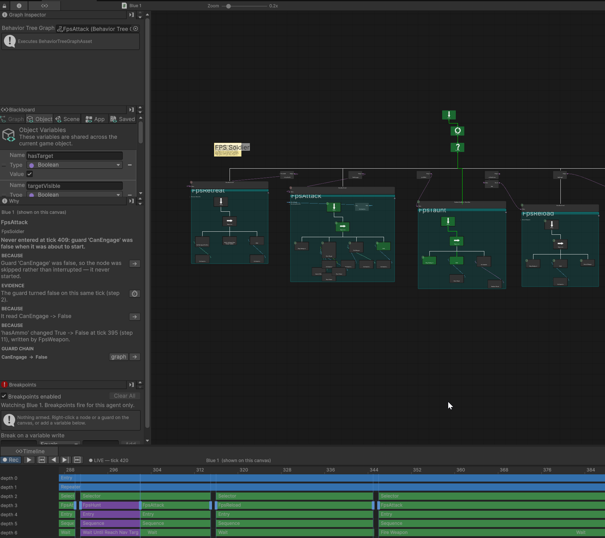
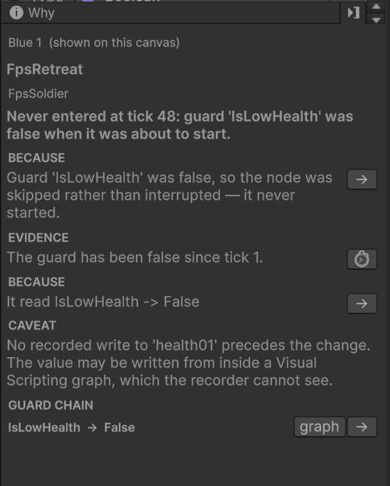

# The Why panel

Click a node, read why it did what it did.



---

## What it answers

The canvas shows what an agent is doing **right now**: the active branch lights up as it runs. The Why panel
answers the harder question, **why did that happen, and why not something else.**

It does not guess. It reads the agent's recording, every node entered and exited, every guard that changed
its mind, every variable written and by whom, and assembles a sentence from it. Every clause is something
that was recorded; where the recording only supports a hunch, the panel says so.

The usual reasons to open it: a branch you expected to run did not, or one you expected to keep running
stopped.

---

## Opening it

1. **Press Play.** Recording is on by default.
2. **Open the tree**, ideally from the agent's **Behavior Tree Machine** so the window knows which agent it
   is showing.
3. **Open the Why panel.** It is in the window's left sidebar, next to **Blackboard** and **Graph
   Inspector**.
4. **Check which agent it is explaining.** The top line names it and says how it was chosen: *shown on this
   canvas*, *selected in the hierarchy*, or *the only agent recording*. If it says **No live agent**, select
   the agent in the hierarchy. See [Debugging: which agent](01-overview.md#which-agent-you-are-looking-at).
5. **Click a node on the canvas.** The panel explains it. Click another and it re-explains.

You can keep reading after pausing. The recording does not move while the editor is paused, which makes
pausing the easiest way to study a moment that just went by. Scrubbing the [Timeline](02-timeline.md)
makes the panel explain that tick instead of the newest one.

---

## Reading the answer



Four parts, top to bottom.

**1. The subject.** The node's name, and under it the path to where it was running, outermost first. The
path matters when a branch is reused: "Attack" alone is ambiguous once two parents run it.

**2. The headline.** One line, the whole answer.

| Headline | What happened | Where to look next |
|---|---|---|
| **Running since tick N** | It is running now | Nothing wrong. The clauses list which guards are holding it open |
| **Aborted at tick N: guard 'X' turned false** | It *was* running and its own guard killed it mid-branch | The guard chain, and the write that flipped it |
| **Taken over at tick N: 'X' took its slot** | It *was* running and a higher-priority sibling became able to run. Nothing under this node turned false | The winner's guard and the write that woke it. The answer lives in the branch that won |
| **Never entered at tick N: guard 'X' was false** | It never started | Why the guard was already false. Often it has been false far longer than you think, and the clause says since when |
| **Exited Success / Failure at tick N** | It ran to completion | If the tree's shape can prove it, a clause names the child whose status caused it |
| **Never ran: nothing about this node is in the recording** | No trace of it at all | The clause naming the higher-priority sibling that won. If the recording is clipped, a CAVEAT says the node may have run before the buffer starts |
| **Has not run yet as of tick N** | You scrubbed to before it first appears | Move the playhead forward |
| **Guard is true / false, since tick N** | You clicked a guard rather than a node | What it protects, and what last changed underneath it |

**"Aborted", "taken over" and "never entered" are deliberately different sentences.** One ran and was
killed by its own precondition, one ran and lost its slot to something more important, one never started.
They send you to different places.

**3. The clauses.** Each is labelled with how much weight to put on it:

| Label | What it means |
|---|---|
| **BECAUSE** | The thing that made it happen. This is the answer |
| **EVIDENCE** | The recorded fact the answer rests on: a write, a guard flip, a returned status. Read this if you do not believe the BECAUSE |
| **CONTEXT** | True and useful, but not part of the cause: how long it ran, how often it repeats |
| **CAVEAT** | A limit on what the panel can claim. **Read these.** They mark the difference between a proven cause and a plausible one |

If a node keeps entering and aborting, a CONTEXT clause says so:

```
CONTEXT   Oscillating: entered 7 times and aborted 6 times in the last 60 ticks.
```

That is *selector thrash*, the classic behavior tree bug: a guard reading a value that flickers, so a branch
starts, dies and restarts every few ticks. The fix is almost never in the branch. It is in whatever writes
the value.

**4. The guard chain.** What the guard was looking at, and what each value was, at the instant it changed its
mind. Ports do not keep a history of their own, so this is captured on the spot when a guard flips. It reads
inward: `Not → True` because `not hasTarget → False`.

### The buttons

| Button | What it does |
|---|---|
| **→** | Selects that node on the canvas. Only shown when the node is on the open canvas; a node inside a sub-tree instance has no button rather than a dead one |
| **⏱** | Scrubs the [Timeline](02-timeline.md) to the tick the clause names, so the canvas shows that moment |
| **graph** | Opens the Visual Scripting snapshot for that guard-chain row |
| *call-site dropdown* | Appears **only** when the selected node ran in more than one place. A shared branch used by two parents is two different stories, and the canvas cannot tell which one you meant |

### The graph snapshot

Most guards are fed by a Function, so "the guard returned false" often is not enough. The **graph** button
opens that graph with the values that were on its wires at that tick.

- The window is banner-marked **SNAPSHOT — not live values** and drawn in a deliberately ghosted style, so
  a snapshot cannot be mistaken for the present.
- Drag to pan, scroll to zoom.
- A wire reading **(not evaluated)** is a wire the flow never took, usually a fallback input. That is
  information about which way the logic went, not a gap in the recording.
- If you edited the graph after recording, wires the trace no longer matches are listed rather than silently
  dropped.

---

## What it will not tell you

**Collections and custom classes show as type names.** A value on a wire is stored as a short string, so a
`List<GameEntity>` reads as its type. Primitives, strings, `Vector3` and anything deriving from
`UnityEngine.Object` read fine.

**Wire values are editor-only.** They come from Unity's own Visual Scripting debug data. In a development
build you still get the guard chain and the graph's final output, not the interior wires.

**A cause it cannot prove is marked as one it cannot prove.** When the panel can trace which variable a
guard reads, the write that changed it is a **BECAUSE**. When it cannot, a guard whose key is computed at
runtime say, the same write appears as **EVIDENCE** with a CAVEAT saying it is the last change before the
flip rather than a proven cause.

**Writes that bypassed BH3 are invisible.** Unity's stock **Set Variable** unit cannot be observed, so a
variable written with it has no recorded writer. Use **Set BT Variable** inside script graphs, and
`AgentVariableWriter` from C#. See [Variables and scope](../2-building-trees/04-variables-and-scope.md#which-writes-are-visible).

**Ticks are not frames.** A tick is one update of *that agent's* tree.

---

## Troubleshooting

| It says | Why |
|---|---|
| *Select a node on the canvas…* | The panel has an agent but no node. Click one |
| *No live agent* | It cannot tell which agent you mean. Select one in the hierarchy, or open the tree from the machine. If several agents are recording and none is selected, it would rather say nothing than guess |
| *Enter play mode to watch an agent* | Nothing is recording. Not in Play mode, or recording is off; the Timeline's **Rec** button turns it back on |
| *This node has no recorded activity in the selected call site* | The node ran somewhere else. Check the call-site dropdown |
| *The recording is empty* | Recording is off for this agent, or it has not ticked yet |
| *The recording is clipped: N older events were dropped* | The buffer holds the most recent 2048 events and the start of the story scrolled away. Reproduce closer to the moment, or raise `BehaviorTreeFlightRecorders.DefaultCapacity` before agents spawn |
| No guard chain on an abort | Chains are captured only when a guard *changes* its answer, and live in a shorter buffer (64 per agent). A guard flipping very fast can push older chains out. `BehaviorTreeFlightRecorders.TracingGloballyEnabled` turns chain capture off entirely; check it if you never see one |

---

## Try it

The reference project's [WhyInspector demo](https://github.com/platinio/bh3-development/tree/main/Assets/ArcaneOnyx/BH3Demos/WhyInspector)
reproduces the classic bug, a guard reading a variable a sensor flickers, so you can see every part of the
panel answer a question you already know the answer to. Lower **Interval Seconds** on the agent below about
0.4 to see the *Oscillating* clause.

## Next

- [Variable watch](04-variable-watch.md) — the value behind the explanation
- [Breakpoints](05-breakpoints.md) — stop the editor *when* it happens rather than asking afterwards
