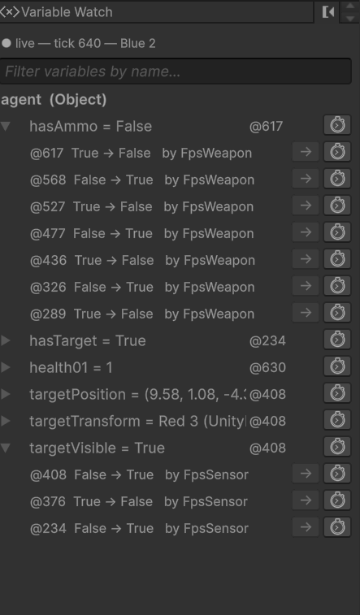

# The Variable Watch

What every variable held at the moment you are looking at, and who put it there.

---

## What it answers

The Blackboard panel shows what an agent's variables are **right now**. That is the wrong question once
something has already gone wrong: by the time you notice the zombie walked past you, `hasTarget` is back to
`false` and the evidence is gone.

The Variable Watch answers the other question: **what was this variable at tick 412, and which node or
sensor set it?** It is built from the same recording the Timeline and the Why panel read, so every row is a
write that actually happened.

The usual reason to open it: a guard flipped and you want to know what changed underneath it. Scrub the
Timeline to the moment, read the value here, click through to whoever wrote it.

---

## Reading the table



| Part | What it means |
|---|---|
| `agent (Object)` | A **store**. Variables are grouped by where they live, not by who wrote them |
| `alertLevel = 2` | The value **at the playhead**, reconstructed from the writes up to that tick |
| `VariableWatchDemoSensor` | Who wrote it last. Shown when the panel is wide enough; always in the history |
| `@1004` | The tick of that last write |
| `⏱` | Scrub the Timeline to that tick |
| `▸` | Expand for this variable's write history |

### The groups are stores

| Group | What it is |
|---|---|
| **agent (Object)** | State belonging to the whole agent: the facts sensors publish, and anything a node writes with kind Object |
| **`<TreeName>` (Graph)** | The root tree's own variables |
| **`<Branch>` (Graph)** | One running branch's private scratch |
| **scene / application / saved** | The wider Unity stores, listed last |

Two things follow, and both are the point:

**A branch running twice gets two groups.** If a tree runs one sub-tree at two call sites, you see
`Attack #1` and `Attack #2` with their own values. They *are* separate, because branch scratch belongs to
the running instance. The `#n` suffix only appears when names collide.

**A node writing agent state is filed under `agent`, not under its branch.** A `Set Variable` inside
`Attack` writing an Object variable is writing agent-wide state; the branch is where the write came *from*,
not where the value lives. The history still says which node did it.

### The write history

Expand a row for the last several writes, most recent first:

```
▸ hasTarget = False          VisionSensor   @1022  ⏱
    @1022  True → False   by VisionSensor          →  ⏱
    @988   False → True   by VisionSensor          →  ⏱
    @902   True → False   by VisionSensor          →  ⏱
    …14 older write(s) not shown
```

| Button | What it does |
|---|---|
| `⏱` | Scrub the Timeline to that write. The canvas ghosts to the same tick |
| `→` | Select the node that wrote it, **opening its asset if the node lives in another tree**. Disabled when the writer is a sensor, which is a MonoBehaviour rather than a node; the tooltip says so |

The list is capped, and a row says how many older writes it is not showing. A variable churning every tick
is worth noticing on its own.

---

## It answers for the playhead, not for now

This is the one rule to internalise. Park the Timeline at tick 300 and **every** value, tick and count in
the table becomes what it was at tick 300. The header turns orange and says so:

```
⏸ values at tick 300 — VariableWatchAgent
```

So the table and the ghosted canvas beside it always describe the same moment. Return to live and it follows
the newest tick again.

---

## What it will not show you

**Variables nobody has written.** The table is built from write events, so a variable declared in the
Blackboard but never assigned has no row. Mixing in live reads would put rows meaning "right now" beside
rows meaning "at tick 300". For current values, use the **Blackboard** panel, or
**Tools → BH3 → Open Flight Recorder Window**.

**Writes that bypass the recorder.** A write only appears if it went through BH3:

| How the write was made | Recorded? | Attributed to |
|---|---|---|
| The **Set Variable** tree node (any node calling `SaveVariable`) | yes | the node; `→` selects it |
| The **Set BT Variable** unit in a script graph | yes | the node that ran the graph |
| A sensor using `AgentVariableWriter` | yes | the component that called it, by name |
| `Variables.Object(go).Set(...)` from C# | **no** | |
| Unity's stock **Set Variable** unit | **no** | |

The last two write the value perfectly well; they are just invisible, and the guard reading that variable
will look like the bug. See [Writing facts from a sensor](../2-building-trees/04-variables-and-scope.md#writing-facts-from-a-sensor).

---

## Troubleshooting

| What you see | Why |
|---|---|
| *Enter play mode, or open a recording in the Timeline panel.* | Not playing, and no file loaded |
| *…has recorded nothing yet.* | The agent exists but its tree has not ticked. Check for a `Repeater` under `Entry` |
| *…recorded no variable writes… N other agents are recording* | You are pointed at the wrong agent. Select the one you want in the hierarchy |
| *No variable matches …* | The filter is hiding everything. Clear it with the `✕` |
| A row you expected is missing | Nothing has written it yet, or it was written by one of the two invisible paths above |
| `→` is greyed out | The writer is a sensor, not a node |

---

## Try it

The reference project's [VariableWatch demo](https://github.com/platinio/bh3-development/tree/main/Assets/ArcaneOnyx/BH3Demos/VariableWatch)
has a sensor publishing three facts, one branch running at two call sites with its own scratch in each,
and a node writing agent state from inside a branch.

## Next

- [Breakpoints](05-breakpoints.md) — right-click a row here to break on the next write
- [Why panel](03-why-panel.md) — what that value *caused*
