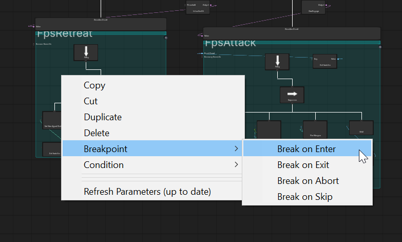
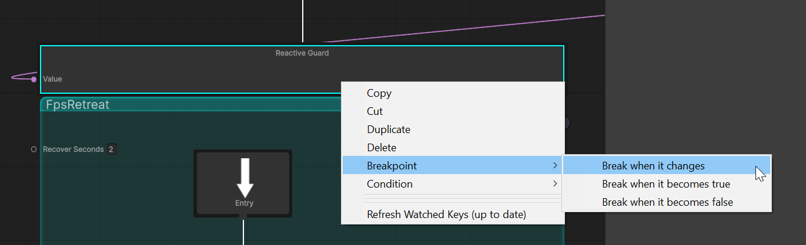
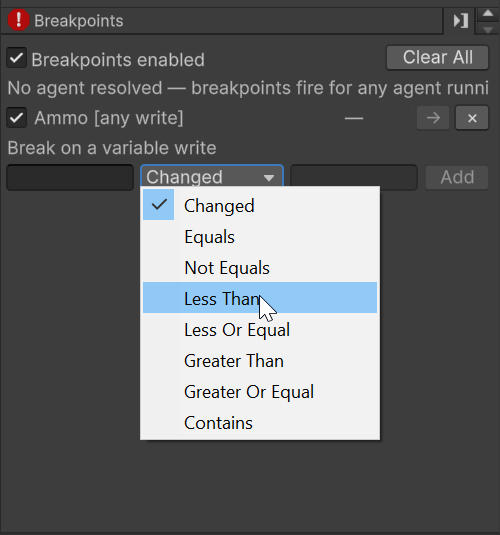

# Breakpoints

Stop the editor the moment a node runs, a variable is written, or a guard changes its mind.

---

## What they answer

The [Why panel](03-why-panel.md) explains *why did that happen* after the fact. Breakpoints **catch it in the
act**: arm one, press Play, and the editor pauses on the exact frame the thing you care about happened, with
the tree frozen around it.

| Kind | Stops when |
|---|---|
| **Node** | a node is entered, exits, is aborted, or is skipped |
| **Guard** | a guard changes its mind, either way or only one way |
| **Variable** | a variable is written, optionally only with a value you name |

Nothing to enable. Breakpoints are matched inside the flight recorder, so they work whenever recording is on.

---

## Arming one


### On a node



Right-click any node on the canvas → **Breakpoint**, and tick the moments you want:

| Moment | Stops when |
|---|---|
| **Break on Enter** | the node starts |
| **Break on Exit** | it stops, whatever it ended on |
| **Break on Abort** | a guard turned false mid-run and killed it |
| **Break on Skip** | a guard was false as it was about to start, so it never ran |

Abort and Skip are different on purpose: *"it was interrupted"* and *"it never started"* are different bugs.
If you are chasing a branch that never runs, **Skip** is usually the one you want.

A node can have several moments armed at once; they are one breakpoint with a mask, not several.

### On a guard



Right-click the guard itself. Guards are asked by their owner rather than entered, so they have no lifecycle,
only a change of mind:

| Option | Stops when |
|---|---|
| **Break when it changes** | either direction |
| **Break when it becomes true** | the branch just became allowed |
| **Break when it becomes false** | the one that aborts a running branch |

Only *changes* are on offer. A guard holds its answer between evaluations, so "stop while it is false"
would pause the editor on the frame you armed it and every frame after.

### On a variable

Right-click a row in the [Variable Watch](04-variable-watch.md): you get the whole operator set, pre-filled
with the value in front of you. Or type a name into the **Breakpoints** panel, which is the only way to name
a variable that is not currently on screen.

---

## The Breakpoints panel



It lives in the left sidebar, next to **Blackboard** and **Why**.

| Control | Does |
|---|---|
| **checkbox** | Enable or disable without losing it |
| **the label** | Click to open the operator, the expected value and **Break on hit #** |
| **hit count** | `3×` fired three times. `0/12` matched twelve times and fired none, see below |
| **→** | Select the node on the canvas |
| **×** | Remove it |
| **Clear All** | Remove everything |
| **Breakpoints enabled** | Master switch: keeps everything armed but stops any of it firing |

The row the editor stopped on is **filled amber and marked `▶`**, matching the ring drawn around the node on
the canvas. On the canvas, a **red dot** means armed; a **grey dot** means armed but switched off.

---

## What happens when one fires

The editor pauses, and four things line up on the moment it stopped:

1. **A line in the console** naming the breakpoint, what happened, and the tick.
2. **The node is selected** and ringed in amber on the canvas.
3. **The Timeline parks on the hit tick**, so the canvas is ghosted to how the tree looked then.
4. **The Why panel and Variable Watch follow the playhead**, so all three describe the same instant.

Press **Play** again to carry on to the next one.

Scrubbing the Timeline while paused is safe: nothing can fire while the editor is paused. Stepping one frame
*does* tick, and can hit.

---

## Comparing variable values

The operator compares the **live value**, not the text the recording shows for it:

| You type | Matches |
|---|---|
| `ammo == 0` | the int `0` |
| `speed == 3.5` | the float `3.5`, whatever your machine's decimal separator; `3,5` works too |
| `hasTarget == true` | the bool `true`, even though it renders as `True` |
| `hp < 5` | any number below five |
| `state contains Attack` | `AttackMelee`, `AttackRanged`, … |

The operators are `changed`, `==`, `!=`, `<`, `<=`, `>`, `>=` and `contains`.

**Ordering applies to numbers only.** A variable can hold a `Vector3`, a `GameObject` or a list, and "less
than" means nothing for those. Rather than fall back to alphabetical order and give a confident wrong
answer, the breakpoint says so on its row:

```
⚠ stance held Standing, which is not a number, so GreaterThan cannot apply.
```

The Variable Watch menu also greys out `<` and `>` when the value in front of you is not a number.

**`contains` on a number matches its text**, so `alertLevel contains 1` stops on `1`, and also on `10`, `11`
and `21`. It fires, and warns:

```
⚠ alertLevel is a number, and 'contains' matches its text — "1" also matches any number containing it.
```

Use `==` when you want a value. A breakpoint that fires *more* often than you expect is harder to notice
than one that never fires, which is why this one warns even though it works as defined.

---

## Break on the Nth hit

Click a row and set **Break on hit #**. Every kind supports it.

This is the answer to an **oscillating guard**, a branch that enters and aborts every few ticks. The
interesting occurrence is rarely the first, and the alternative is pressing Play twenty-nine times. While it
counts up, the row reads `0/12`: matched twelve times, fired none, on purpose.

---

## Which agent they fire for

A breakpoint is armed on a **node**, and that node belongs to a tree any number of agents may be running.
So breakpoints are narrowed to **the agent the debugger is already pointed at**, the same one the ghosted
canvas, the Why panel and the Variable Watch describe. The panel says which agent that is. If nothing
resolves an agent, breakpoints fire for **any** of them.

A sub-tree used at two call sites keeps the same node guids, so one breakpoint covers both copies. The
console line and the Why panel's call-site path say which copy it was.

---

## Where they are kept

`UserSettings/BH3Breakpoints.json`, **per developer and gitignored.** A breakpoint is a statement about what
*you* are debugging this afternoon, not a property of the tree; committing them would pause your teammates'
editors on nodes they were not looking at. To hand someone a repro, copy them the file.

They survive domain reloads and editor restarts, and are keyed by node guid, so renaming a node, moving it on
the canvas, or reformatting the asset does not break them.

---

## Troubleshooting

| Problem | Why |
|---|---|
| Nothing fires at all | Recording is off (the Timeline's **Rec** button, or `BehaviorTreeFlightRecorders.GloballyEnabled`), or that one agent's recorder was paused in the Flight Recorder window; the panel shows a warning when that applies. Check the **Breakpoints enabled** switch too |
| It fires for the wrong agent, or not for the one you want | Read the line at the top of the panel. Select the agent in the hierarchy, or open its tree from the machine rather than from the asset |
| A `<` or `>` breakpoint never fires | Read its row: if the value is not a number, it says so. Use `==` or `contains` for text |
| A `contains` breakpoint fires too often | The variable is a number, so it is matching text. Use `==` |
| A node breakpoint on a branch that never runs | The branch is being *skipped*, not entered. Arm **Break on Skip**, then read the Why panel for which guard refused it |
| The editor pauses somewhere unexpected | The amber row in the Breakpoints panel is the one that stopped it. The console line says the same |

---

## Next

- [Why panel](03-why-panel.md) — once it stops, this tells you why
- [Variable watch](04-variable-watch.md) — and this tells you what the variables were when it stopped
