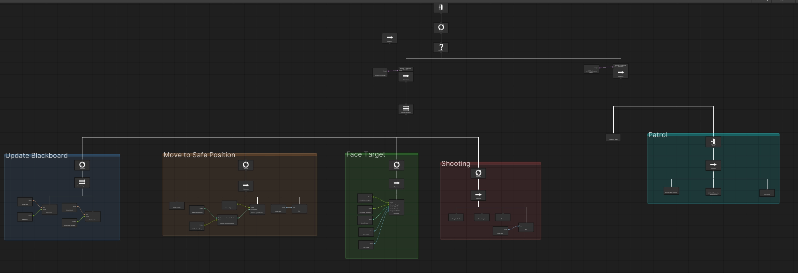

# Best Practices

Patterns that keep behavior trees reusable and easy for designers to work with.

---

## Fetching Information and Game Logic are Two Separate Puzzle Pieces

Traditionally, when we create behavior tree nodes, fetching the information and the game logic are part of
the same node:

```csharp
public class SetNavAgentPosition : BehaviorTreeNode
{
    public string targetPositionKey;

    public override ExecutionStatus OnUpdate()
    {
        // fetch information from the blackboard
        Vector3 targetPosition = blackboard.Get<Vector3>(targetPositionKey);
        // game logic
        navAgent.SetDestination(targetPosition);

        return ExecutionStatus.Success;
    }
}
```

This node is hard to reuse. Something else must constantly update the blackboard before it can run, and
designers can't change what it reads without a developer's help.

Split the two responsibilities instead. One node that **fetches**:

```csharp
using ArcaneOnyx.GraphCore;
using Unity.VisualScripting;
using UnityEngine;

namespace ArcaneOnyx.BehaviorTree
{
    [GraphCreateMenu("Custom/Get Escape Position")]
    public class GetEscapePosition : GameplayNode
    {
        [DoNotSerialize] public ValueOutput Value { get; private set; }

        public override string NodeName => "Get Escape Position";

        protected override void Definition()
        {
            base.Definition();

            Value = ValueOutput<Vector3>(nameof(Value), () => CalculateEscapePosition());
        }

        private Vector3 CalculateEscapePosition()
        {
            // whatever logic your game uses to pick a safe spot
            return transform.position - transform.forward * 10f;
        }
    }
}
```

And one node that **acts**:

```csharp
using ArcaneOnyx.GraphCore;
using Unity.VisualScripting;
using UnityEngine;
using UnityEngine.AI;

namespace ArcaneOnyx.BehaviorTree
{
    [GraphCreateMenu("Custom/Set Nav Agent Position")]
    public class SetNavAgentPosition : GameplayNode
    {
        [DoNotSerialize] public ValueInput NavPosition { get; private set; }

        public override string NodeName => "Set Nav Agent Position";

        protected override void Definition()
        {
            base.Definition();

            NavPosition = ValueInput<Vector3>(nameof(NavPosition));
        }

        public override ExecutionStatus OnUpdate()
        {
            // we don't care where the value comes from, it can still be a blackboard
            Vector3 position = NavPosition.GetValue<Vector3>();
            gameObject.GetComponent<NavMeshAgent>().SetDestination(position);

            return ExecutionStatus.Success;
        }
    }
}
```

Now each node does one thing. `SetNavAgentPosition` works with any `Vector3` source, and `GetEscapePosition`
can feed any node that needs a position. Designers mix and match without touching code.

---

## Prefer Conditional Executions Over Condition Nodes for Interruptions

A Condition node is only checked when tree execution *reaches* it. If your Idle branch is already running, a
Condition placed in front of it won't be asked again until the tree loops back around — so the AI keeps
idling even when an enemy shows up.

A Conditional Execution is attached directly to a node as a guard, and it is re-evaluated on **every tick**
while that node runs:

- If the guard is false when the node is about to enter, the node is skipped.
- If the guard turns false *while* the node is running, the node immediately returns `Failure`, and the whole
  branch under it is aborted.

That second point is what makes them the right tool for interruptions. Guard your Idle branch with a "no
enemy in range" Conditional Execution, and the moment an enemy appears the branch fails, letting a Selector
above it fall through to the Combat branch on the same frame.

> **Use Condition nodes for decisions made at a specific point in the flow. Use Conditional Executions when a
> branch should stop being valid the instant the world changes.**

Guards on the same node are ANDed, so there is no need for an `And` node — attach several and the branch runs
only when all of them hold.

To create your own, inherit from `ConditionalExecution` and implement `Evaluate()`. For simple cases use the
built-in **Boolean Conditional** and wire any boolean source into its port.

---

## Think of Behavior Tree Branches Like a Function that Does Just One Thing



Each branch does exactly one job and knows nothing about the others. The Patrol branch doesn't care about
enemies; only a Conditional Execution decides when to interrupt it.

Once your branches are that focused, you can share them across different AIs using
[Sub-Behavior Trees](sub-behavior-trees.md). Designers then build new enemies by picking existing branches,
passing arguments, and assigning priorities — creating the illusion of unique behavior from reusable pieces.

---

## Give Each Branch Its Own Tree Asset

Modularity is where BH3 earns its keep, and the mechanism is two features working together:

- **`Run Behavior Tree Graph`** lets a tree run another tree, so a branch can be its own asset.
- **A Conditional Execution on top of that node** decides whether the branch is allowed to run at all.

Together they mean a branch never needs to know what else exists. A Zombie's Idle sub-tree doesn't check for
enemies and doesn't decide to transition to Attack — the guard above it handles that. Every branch becomes a
separate asset that knows nothing about its siblings, and the only thing that knows about all of them is the
Zombie tree that assembles them.

Prefer one asset per branch. If you keep a branch inline, have a reason.

---

## Don't Write a Node for Every Small Thing

Before adding a C# node, decide which of these it is:

| Situation | Reach for |
|---|---|
| Genuinely reusable across agents | A C# node |
| Specific to one tree or one situation | A **Script Graph Variable** node |
| Specific, but the graph would be large and unreadable | A C# node after all |

A pile of one-off node types is as much of a maintenance burden as a pile of one-off scripts.

---

## Remember That Canvas Position Is Priority

Children execute in **canvas X order**, left to right. A Selector's leftmost child is its highest-priority
branch.

This is easy to forget because the connecting lines don't change when you drag a node sideways — but the
priority does. Lay out branches in the order you want them tried, and use sticky notes to say what that order
means.

---

## See also

- [Sub-Behavior Trees](sub-behavior-trees.md) — parameters, scopes, and reuse
- [Ports and Wiring](ports-and-wiring.md) — the seam that makes all of this possible
- [The Why Panel](why-panel.md) — for when a branch doesn't run and the reason isn't obvious
