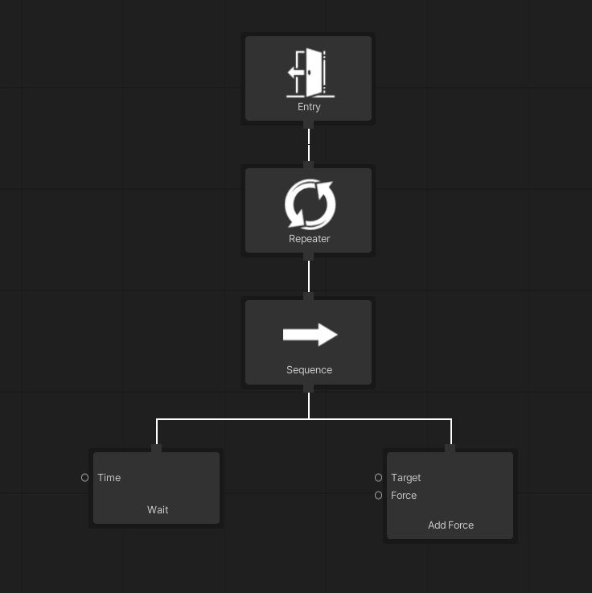
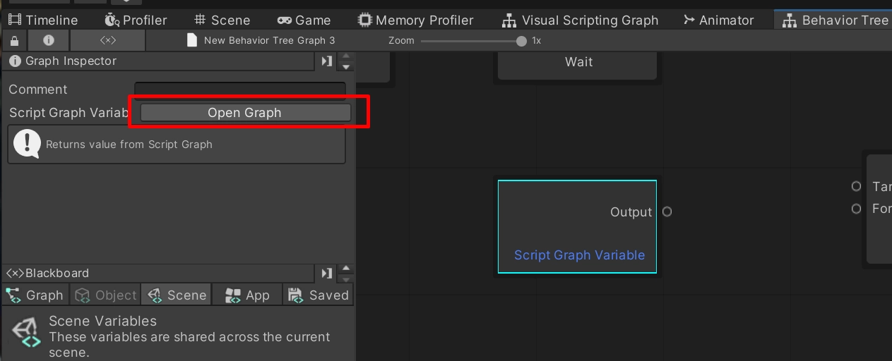
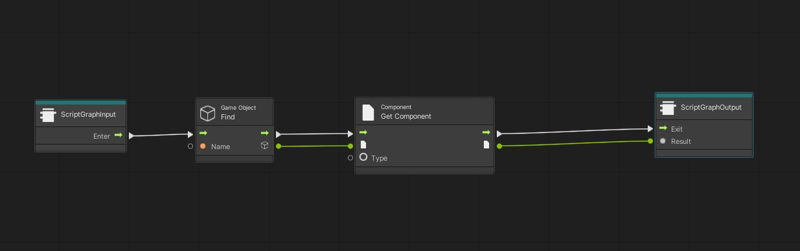
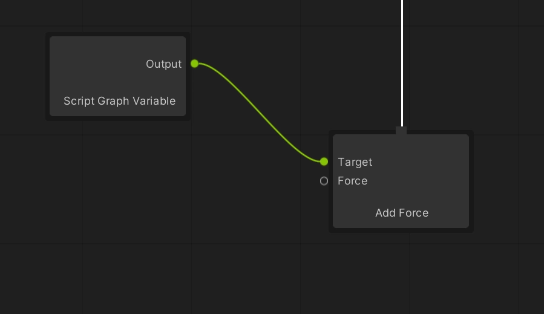

# Ports and Wiring

The idea BH3 is built around: a node's logic and its data are two separate things.

---

## Why ports exist

Ports separate node logic from where the data comes from. A node doesn't care whether a value arrives from
the Blackboard, from a component, from another system, or from a literal you typed in. You connect a source
in the graph and the node just reads it — no glue scripts, no code keeping a blackboard in sync.

That is the whole trick, and it is worth stating plainly because most behavior tree implementations do the
opposite:

```
Traditional:   [ node ] ── knows the blackboard key, fetches, then acts
BH3:           [ source ] ──▶ port ──▶ [ node ]   node only ever reads the port
```

---

## Value inputs

A `ValueInput` is a port a node reads from.

```csharp
[GraphCreateMenu("Custom/Wait For Duration")]
public class WaitForDurationNode : GameplayNode
{
    [DoNotSerialize] public ValueInput Duration { get; private set; }

    private float elapsed;

    public override string NodeName => "Wait For Duration";

    protected override void Definition()
    {
        base.Definition();
        Duration = ValueInput<float>(nameof(Duration), 2f);
    }

    public override void OnEnter() => elapsed = 0f;

    public override ExecutionStatus OnUpdate()
    {
        elapsed += Time.deltaTime;
        return elapsed >= Duration.GetValue<float>()
            ? ExecutionStatus.Success
            : ExecutionStatus.Running;
    }
}
```

In the editor this node shows a **Duration** port on its left. By default it uses the `2f` declared in code.
Wire any compatible `ValueOutput<float>` into it and the node neither knows nor cares where the value came
from — it just calls `GetValue<float>()`.

> The second argument to `ValueInput<T>` is the **default**. A port declared without one *must* be
> connected — reading it otherwise throws. See
> [Ports you must connect](node-reference.md#ports-you-must-connect).

## Value outputs

A `ValueOutput` is a port a node offers to others.

```csharp
[GraphCreateMenu("Custom/Get Health Percent")]
public class GetHealthPercentNode : GameplayNode
{
    [DoNotSerialize] public ValueOutput HealthPercent { get; private set; }

    private HealthComponent healthComponent;

    public override string NodeName => "Get Health Percent";

    protected override void Definition()
    {
        base.Definition();
        HealthPercent = ValueOutput<float>(nameof(HealthPercent), GetHealthPercent);
    }

    public override void OnAwake()
    {
        healthComponent = gameObject.GetComponent<HealthComponent>();
    }

    private object GetHealthPercent()
    {
        if (healthComponent == null) return 0f;
        return healthComponent.CurrentHealth / healthComponent.MaxHealth;
    }

    public override ExecutionStatus OnUpdate() => ExecutionStatus.Success;
}
```

> `ValueOutput` takes a **delegate**, called on demand each time a connected node reads the port. The value
> is never cached — it is always current.

Nodes that only expose a `ValueOutput` are never given a parent connection. They are pulled through ports,
so they sit unparented on the canvas, and that is correct.

---

## A worked example: Move To Target

```csharp
[GraphCreateMenu("Custom/Move To Target")]
public class MoveToTargetNode : GameplayNode
{
    [DoNotSerialize] public ValueInput Target { get; private set; }
    [DoNotSerialize] public ValueInput Speed { get; private set; }

    public override string NodeName => "Move To Target";

    protected override void Definition()
    {
        base.Definition();
        Target = ValueInput<Transform>(nameof(Target));
        Speed  = ValueInput<float>(nameof(Speed), 3.5f);
    }

    public override ExecutionStatus OnUpdate()
    {
        var target = Target.GetValue<Transform>();
        var speed  = Speed.GetValue<float>();

        if (target == null) return ExecutionStatus.Failure;

        transform.position = Vector3.MoveTowards(
            transform.position, target.position, speed * Time.deltaTime);

        return Vector3.Distance(transform.position, target.position) < 0.1f
            ? ExecutionStatus.Success
            : ExecutionStatus.Running;
    }
}
```

Two ports, and each has several equally valid sources:

**Target**
- a **Get Variable** node reading an `Object` variable — the agent chases whatever is stored there
- a **Find Game Object** node — the agent searches the scene at runtime
- a **This/Transform** literal — the agent moves toward itself (unlikely, but the port accepts it)

**Speed**
- leave it unconnected and the `3.5f` default applies
- a **Float** literal, to set a value per-asset without touching code
- a **Get Variable** reading a `movementSpeed` graph variable, tuned per enemy

The node's code is identical in every case. That is the point.

---

## Feeding a port from Visual Scripting

Ports get genuinely powerful when combined with Visual Scripting. A **Script Graph Variable** node runs a
graph that can fetch a value from anywhere in the game, and its output wires into any behavior tree port of
a matching type.

Here's the whole loop on a small tree — `Entry → Repeater → Sequence → (Wait, Add Force)`:



**1. Create the node** — `Unity/Visual Scripting/Script Graph Variable`. Select it and click **Open Graph**.



**2. Build a graph that returns the value** — here, finding a GameObject by name and getting its Rigidbody.



**3. Connect the output** to the **Target** input of the Add Force node.



**4. Press play.** ([short video](https://youtu.be/6owI5ZZtUJg))

The Add Force node has no idea where that Rigidbody came from, and the Script Graph Variable can fetch a
value from anywhere in the game. Neither needs to know about the other.

---

## Where BH3 embeds Visual Scripting

| Node | What it holds |
|---|---|
| **Script Graph Variable** | One graph that produces a value for a port |
| **Script Graph** | Four graphs, one per lifecycle hook (`OnAwake`, `OnEnter`, `OnUpdate`, `OnExit`). The `OnUpdate` graph must output an `ExecutionStatus` |
| **Run Script Graph** | One `ScriptGraphAsset`, executed on enter |

> Nodes holding a Visual Scripting graph **cannot be copied or duplicated**, because they reference their
> Script Graph directly. Create a new node and copy the graph contents by hand.

### Reading and writing variables from a graph

BH3 ships `Get BT Variable` and `Set BT Variable` units under **BH3 → Variables**. Prefer **`Set BT
Variable`** over Unity's built-in `Set Variable`: the built-in one cannot be observed, so a value written
with it has no recorded writer and [The Why Panel](why-panel.md) can never tell you what changed it.

`Get BT Variable` supports a **Fallback**, worth enabling for anything a reusable branch reads — without it,
reading a name the agent doesn't declare throws, so a branch that works on one prefab breaks on another.

---

## See also

- [Custom Nodes](custom-nodes.md) — declaring your own ports
- [Best Practices](best-practices.md#fetching-information-and-game-logic-are-two-separate-puzzle-pieces) — why to keep fetching and acting apart
- [Sub-Behavior Trees](sub-behavior-trees.md) — ports as parameters at a branch boundary
